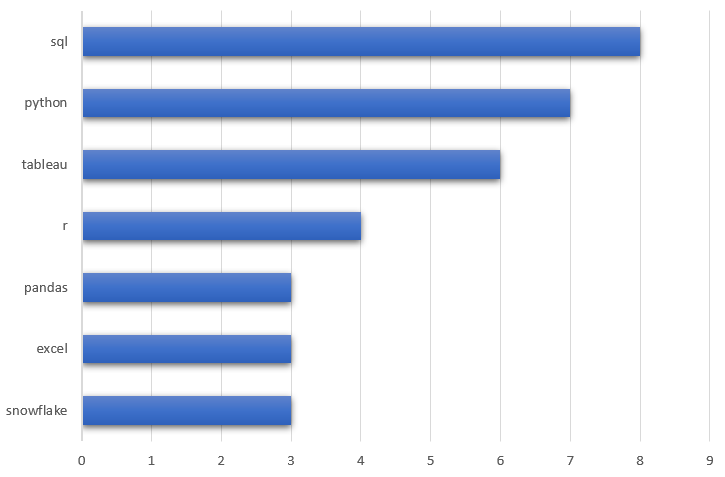

# Introduction
This project explores the data job market with a focus on Data Analyst roles. The analysis looks into the top-paying positions, in-demand skills, and how skill demand aligns with salary in the field. Using SQL queries, I dig into the data to uncover insights about what employers value most and what skills pay the best.

Check out the queries here: [project_sql folder](/project_sql/)
# Background
This project explores the data analyst job market with the goal of identifying top-paying roles, in-demand skills, and the intersection of salary and skill demand. It was built using SQL to query a dataset of job postings covering job titles, salaries, locations, and required skills.

Data hails from Luke Barrousse [SQL Course](/https://www.youtube.com/watch?v=7mz73uXD9DA&t=13431s/)

### The analysis was guided by the following questions:

1. What are the top-paying data analyst jobs?
2. What skills are required for these top-paying jobs?
3. What skills are most in demand for data analysts?
4. Which skills are associated with higher salaries?
5. What are the most optimal skills to learn?
# Tools I Used
- **SQL:** Core tool for querying and analysis
- **PostgreSQL:** Database management system
- **Visual Studio Code:** Environment for running SQL queries
- **Git & GitHub:** Version control and project sharing
# The Analysis
Each query in this project was designed to answer a specific question about the data analyst job market.

### 1. Top-Paying Data Analyst Jobs

To find the highest-paying opportunities, I filtered job postings for data analyst roles with available salary data, focusing on remote positions. This analysis highlights where the most lucrative roles are.
```SQL
SELECT
        job_id,
        job_title
       job_title_short,
       job_location,
       salary_year_avg,
       job_schedule_type
       job_posted_date,
       name AS company_name
        
FROM job_postings_fact
LEFT JOIN company_dim ON job_postings_fact.company_id = company_dim.company_id

WHERE job_title_short = 'Data Analyst' AND 
job_location = 'Anywhere' AND salary_year_avg IS NOT NULL

ORDER BY salary_year_avg DESC

LIMIT 10
```
### Breakdown of the Top Data Analyst Jobs in 2023

- Wide Salary Range: The top 10 paying data analyst roles span from $184,000 to $650,000, showing the strong earning potential in the field.

- Diverse Employers: High salaries are offered by companies such as SmartAsset, Meta, and AT&T, reflecting demand across multiple industries.

- Job Title Variety: Roles range from Data Analyst to Director of Analytics, highlighting the breadth of opportunities and specializations within data analytics.

## The Analysis 

### 1. Top paying Data Analysis Jobs

*I exported the SQL query results and created a bar graph in Excel to illustrate the top 10 salaries for data analyst roles.*

### 2. Skills for Top-Paying Jobs
To uncover the skills driving higher salaries, I joined job postings with the skills dataset. This revealed the specific technical skills and tools employers prioritize when offering top compensation for data analyst roles.
```sql
SELECT
    job_postings_fact.job_id,
        job_title,
       job_postings_fact.salary_year_avg,
       name AS company_name,
       skills AS skill_required
        
FROM job_postings_fact
LEFT JOIN company_dim ON job_postings_fact.company_id = company_dim.company_id
LEFT JOIN skills_job_dim ON job_postings_fact.job_id = skills_job_dim.job_id
LEFT JOIN skills_dim on skills_job_dim.skill_id = skills_dim.skill_id

WHERE job_title_short = 'Data Analyst' AND 
job_location = 'Anywhere' AND salary_year_avg IS NOT NULL

ORDER BY salary_year_avg DESC

LIMIT 10
```
### Breakdown of Most Demanded Skills (Top 10 Highest-Paying Data Analyst Jobs, 2023):

- SQL – required in 8 out of 10 roles, making it the most in-demand skill.

- Python – close behind, appearing in 7 roles.

- Tableau – featured in 6 roles, showing strong demand for visualization expertise.

- Other Skills – tools like R, Snowflake, Pandas, and Excel also appear, though less frequently, reflecting diverse technical expectations.


*I exported the SQL query results and used Excel to create a bar graph showing the frequency of skills required for the top 10 highest-paying data analyst jobs.*

### 3. In-Demand Skills for Data Analysts
This query identified the skills most frequently listed in job postings, highlighting the tools and technologies with the highest overall demand in the data analyst job market.

```sql
WITH demand_skills AS (
SELECT skills,job_title_short
from skills_dim


LEFT JOIN skills_job_dim ON skills_job_dim.skill_id =
skills_dim.skill_id
LEFT JOIN job_postings_fact  ON job_postings_fact.job_id =
skills_job_dim.job_id

WHERE job_title_short = 'Data Analyst'
)

SELECT skills, count(skills) as Total_skills FROM demand_skills
GROUP BY skills
ORDER BY Total_skills DESC

LIMIT 10
```
| Skills     | Demand Count |
|------------|--------------|
| SQL        | 7,291        |
| Excel      | 4,611        |
| Python     | 4,330        |
| Tableau    | 3,745        |
| Power BI   | 2,609        |
| R          | 2,142        |
| SAS        | 1,866        |

### 4. Skills Based on Salary
By analyzing the average salaries linked to different skills, this query revealed which technical skills are most strongly associated with higher-paying data analyst roles.

### Breakdown of Top-Paying Skills for Data Analysts

1. High Demand for Big Data & ML Skills
Top salaries go to analysts skilled in big data technologies (PySpark, Couchbase), machine learning tools (DataRobot, Jupyter), and Python libraries (Pandas, NumPy). This reflects the industry’s strong valuation of data processing and predictive modeling expertise.

2. Software Development & Deployment Proficiency
Knowledge in development and deployment tools (GitLab, Kubernetes, Airflow) shows a lucrative crossover between data analysis and engineering. These skills enable automation and efficient data pipeline management, both highly rewarded in the job market.

3. Cloud Computing Expertise
Proficiency in cloud and data engineering tools (Elasticsearch, Databricks, GCP) highlights the shift toward cloud-based analytics environments. Cloud proficiency significantly boosts earning potential for data analysts.

```sql
WITH demand_skills AS (
    SELECT 
        skills_dim.skills,
        job_title_short,
        ROUND(AVG(job_postings_fact.salary_year_avg), 0) AS average_salary
    FROM skills_dim
    LEFT JOIN skills_job_dim 
        ON skills_job_dim.skill_id = skills_dim.skill_id
    LEFT JOIN job_postings_fact  
        ON job_postings_fact.job_id = skills_job_dim.job_id
    WHERE job_postings_fact.salary_year_avg IS NOT NULL
    GROUP BY skills_dim.skills, job_title_short
)

SELECT 
    skills,  
    average_salary
FROM demand_skills
WHERE job_title_short = 'Data Analyst'
ORDER BY average_salary DESC
LIMIT 25;

```
| Skills        | Average Salary |
|---------------|----------------|
| PySpark       | $208,172       |
| Bitbucket     | $189,155       |
| Couchbase     | $160,515       |
| Watson        | $160,515       |
| DataRobot     | $155,486       |
| GitLab        | $154,500       |
| Swift         | $153,750       |
| Jupyter       | $152,777       |
| Pandas        | $151,821       |
| Elasticsearch | $145,000       |
| Golang        | $145,000       |
| NumPy         | $143,513       |
| Databricks    | $141,907       |
| Linux         | $136,508       |
| Kubernetes    | $132,500       |

*Table of the Average Salary for the Top 10 Paying Skills for Data Analysts*

### 5. Most Optimal Skills to Learn

To identify the most strategic skills for data analysts, I combined insights from both demand (frequency in job postings) and salary levels.
This approach highlights the skills that are not only high-paying but also widely sought after by employers.

The goal: pinpoint where demand meets strong compensation, helping data analysts prioritize their learning path for maximum career impact.

```sql
WITH skills_demand AS (
    SELECT
        skills_job_dim.skill_id,
        skills_dim.skills,
        COUNT(skills_job_dim.job_id) AS demand_count
    FROM job_postings_fact
    INNER JOIN skills_job_dim 
        ON job_postings_fact.job_id = skills_job_dim.job_id
    INNER JOIN skills_dim 
        ON skills_job_dim.skill_id = skills_dim.skill_id
    WHERE job_postings_fact.job_title_short = 'Data Analyst'
      AND job_postings_fact.salary_year_avg IS NOT NULL
      AND job_postings_fact.job_work_from_home = TRUE
    GROUP BY skills_job_dim.skill_id, skills_dim.skills
),
average_salary AS (
    SELECT
        skills_job_dim.skill_id,
        ROUND(AVG(job_postings_fact.salary_year_avg), 0) AS avg_salary
    FROM job_postings_fact
    INNER JOIN skills_job_dim 
        ON job_postings_fact.job_id = skills_job_dim.job_id
    INNER JOIN skills_dim 
        ON skills_job_dim.skill_id = skills_dim.skill_id
    WHERE job_postings_fact.job_title_short = 'Data Analyst'
      AND job_postings_fact.salary_year_avg IS NOT NULL
      AND job_postings_fact.job_work_from_home = TRUE
    GROUP BY skills_job_dim.skill_id
)
SELECT
    
    skills_demand.skills,
    demand_count,
    avg_salary
FROM skills_demand
INNER JOIN average_salary 
    ON skills_demand.skill_id = average_salary.skill_id
WHERE demand_count > 10 
ORDER BY  avg_salary DESC , demand_count DESC
LIMIT 20;

```

# What I Learned 
### During this project, I gained valuable skills and hands-on experience, including:

- Writing complex SQL queries for real-world analysis.
- Performing data aggregation with GROUP BY, COUNT(), and AVG().
- Applying analytics and problem-solving techniques to turn raw data into insights.
- Using VS Code with PostgreSQL for efficient query execution.
- Leveraging Git and GitHub for version control and collaboration.
- Creating visualizations to present findings clearly.
- Exploring how ChatGPT can assist with SQL analytics and explanation.

# Conclusions
### Insights
From the analysis, several key insights emerged:

**1. Top-Paying Data Analyst Jobs:** Remote data analyst roles show a wide salary range, with the highest reaching $650,000, highlighting the lucrative potential of the field.

**2. Skills for Top-Paying Jobs:** Advanced SQL proficiency is a common requirement for the highest-paying jobs, making it a critical skill for boosting earning potential.

**3. Most In-Demand Skills:** SQL also tops the list of most requested skills in job postings, underscoring its importance for job seekers.

**4. Skills with Higher Salaries:** Specialized or niche skills like SVN and Solidity are tied to the highest average salaries, showing that rare expertise can command a premium.

**5. Optimal Skills for Market Value:** SQL not only leads in demand but also aligns with strong salary offers, making it one of the most strategic skills for data analysts to learn.

### Closing Thoughts

This project not only strengthened my SQL skills but also provided meaningful insights into the data analyst job market. The analysis highlights how understanding both in-demand skills and high-paying skills can guide more strategic career decisions.

- For aspiring data analysts, the key takeaway is clear:
- Focus on foundational skills like SQL that dominate job demand.
- Explore specialized tools and technologies that command higher salaries

- Commit to continuous learning to stay relevant as the field evolves.

By aligning skill development with market trends, data analysts can position themselves more competitively and unlock greater opportunities in this dynamic field.
